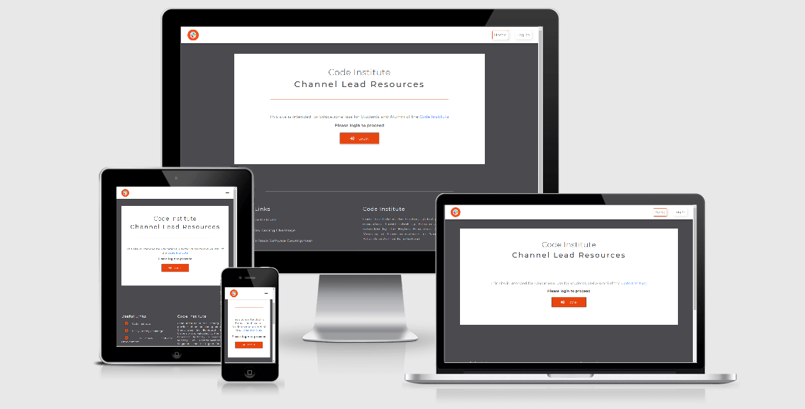
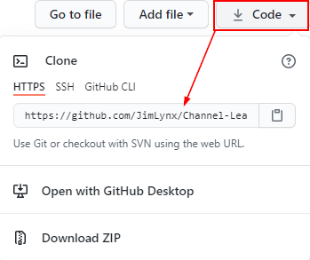
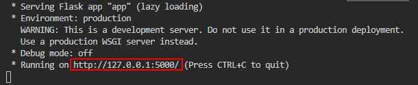

# Table of Contents

> - [Overview](#overview)
> - [User Stories](#user-stories)
> - [UX](#ux)
> - [Features](#features)
> - [Technologies Used](#technologies-used)
> - [References for learning](#references-for-learning)
> - [Testing](#testing)
> - [Project barriers and solutions](#project-barriers-and-solutions)
> - [Code validity](#code-validity)
> - [Version Control](#version-control)
> - [Deployment](#deployment)
> - [Credits](#credits)
> - [Acknowledgments](#acknowledgments)
> - [Support](#support)

Site deployed on Heroku [HERE](https://channel-lead-resources.herokuapp.com/)

**Please note: To open any links in this document in a new browser tab, please press `CTRL + Click`.**

## Overview

Every 6 weeks a current student from each of the four main sections of the course is selected to act as a Channel Lead for that respective channel.

Up until now, the Channel Leads have been posting their slideshows, videos and PDF lessons/presentations in respective Slack Channels and 'Pinning' them in the channels. However, this procedure has proven that the information is not intuitive to find and students are asking many questions daily that are answered in these resources.

The aim of this project is to provide a single resource platform for the Code Institute Slack community to easily access these valuable and helpful resources. Not only will this increase learning process for students, but also aims to minimise the amount of questions raised in Slack Channels, and relieve congestion on the Tutor Support platform.

> [Back to Top](#table-of-contents)  

## User Stories

### :man_student: :woman_student: Users _(Code Institute Students)_

- As a user I would like to **have access to past Channel Lead presentations** in one place, so that I can:

  - **periodically refer to them after the live presentations**
  - **refer to them if I cannot make the live presentations**

- As a user I would like to **be able to search the site**, so that I can **easily find resources that I am looking for**
- As a user I would like to **leave a comment** so that I can **recommend future topics to cover**
- As a user I would like to **rate a post** (like/dislike-emojis) so that I can **visibly show how valuable the particular resource is to me** (Moved to [Features Left to Implement](#features-left-to-implement))
- As a user I would like to **access the information from anywhere**, so that I can **watch and read presentations on my mobile phone/tablet**

### :white_circle: Admin_(Code institute Slack Channel Leads)_

- As an Admin I would like the ability to **log into an admin account**, so that I can **create resource posts**
- As an Admin I would like the ability to **upload my presentations**, so that I can **add new material to the site**
- As an Admin I would like the ability to **update my presentations**, so that I can **maintain material previously uploaded to most recent versions**
- As an Admin I would like the ability to **delete my presentations**, so that I can **remove outdated information, which may become irrelevant due to technological advances**
- As an Admin I would like the **ability for users to review my presentations**, so that I can **be informed of how useful they are and if anything can be improved upon**

### :red_circle: Superuser_(Developer-Site Creator)_

In addition to the above,

- As a Superuser I would like to be able to **keep information aimed at Code Institute Students**, so that **material posted is not directly available to the general public**

- As a Superuser I would like to be able to **Create Admin accounts**, so that I can **assign them to new users**
- As a Superuser I would like to be able to **Delete User accounts**, so that I can **maintain control of user accounts**
- As a Superuser I would like to be able to **Update Category names**, so that I can **ensure the site is kept neat**
- As a Superuser I would like to be able to **Delete Categories**, so that I can **keep the site clean and clutter free**

### :large_blue_circle: Assessor (_Milestone Project Assessor account_)

- As an Assessor, I will require full access to all Superuser privileges, so that I can gain full access in order to assess all aspects of the project

> [Back to Top](#table-of-contents)  

## UX

This website project will target Code Institute Students undertaking the Diploma in Full Stack Software Development. The priority focus is on providing a fluent and structured resource and catalogue of current and past Channel Lead presentations.

### 1. Strategy

#### Project and User Goals

- Provide an easy to navigate resource platform for hosting Channel Lead presentations and videos

- Provide a pre-determined student User account for Code Institute students to be able to log in and access the resources
- Provide Admin account for Channel Leads, to enable them to log in and post and manage presentations
- Provide Superuser account for Site owner to enable frontend login accounts management
- Provide Assessor account to enable an assessor to gain full access to all functionality in order to grade the project
- Design backend functionality focussed on defensive design
- Design frontend UX for:
  - Clean and intuitive navigation
  - Familiarity, using Slack and Code Institute 'look and feel'
  - Responsiveness for use on mobile phone and tablet devices

#### Main Sections to cover

- **:file_folder: Milestone 1** - Main focus in HTML, CSS (& Bootstrap)
- **:file_folder: Milestone 2** - Main focus in JavaScript (& jQuery) and API's
- **:file_folder: Milestone 3** - Main focus in Python, Databases and CRUD
- **:file_folder: Milestone 4** - Focus on Django Full Stack Frameworks
- **:file_folder: Version Control** - All topics relating to Git, IDE's, Repositories and Deployment
- **:file_folder: General** - All other topics

### 2. Scope

- Fits in with my current skill-set of HTML, CSS, JavaScript, Python, Flask and MongoDB
- Implement platform for **links** to PDF content
- Implement platform for **links** to Video content
- Allow Users to Read material posted
- Allow Admin to Create, Read, Update and Delete material
- Allow Superuser to Create, Read, Update and Delete material
- Allow Superuser to Create, Read, Update and Delete Login Credentials
- Allow separate Assessor Login, with full rights to investigate all aspects and functionality

### 3. Structure

The overall structure is for ease of navigation to each section

- Top navigation menu for general public displays only Home and Login links
- Logged in Student user account has additional access to Resources and Contact pages.
- Logged in Lead user account has additional access to Manage Resources and Manage Categories pages
- Logged in Superuser and Assessor user accounts have additional access to Manage Users page.

### 4. Skeleton

- Navigation bar - Menu with links pointing to each page.
  - Home - Intro button leading to Login Page
  - Login Page with basic form with dropdown options for each user type and password field
  - Resource page with information on the site, search functionality and collapsible resource posts
  - Contact page with feedback/suggestion form
  - Admin Dashboard (depending on credentials) with dropdown links to:
        - Manage Users page
        - Manage Resources page (with button redirect to Add/Edit Resource page)
        - Manage Categories page (with button redirect to Edit Category page)

- Public (not logged in) [Public Wireframe](static/wireframes/wireframe-public.pdf)
- Login credentials and accessibility
  - Student (User) Logged in [Student Wireframe](static/wireframes/wireframe-student.pdf)
    - Access to Resources, Contact pages and Logout link
  - Lead Logged in [Lead Wireframe](static/wireframes/wireframe-lead.pdf)
    - Access to Resources, Manage Resources, Contact pages and Logout link
  - Superuser Logged in [Superuser Wireframe](static/wireframes/wireframe-superuser-assessor.pdf)
    - Access to Resources, Manage Resources, Manage Categories, Manage Users, Contact pages and Logout link
  - Assessor Logged in (Wireframe as above for Superuser)
    - Access to same as above mentioned in Superuser Logged in

- Footer with Useful Links, Information on the Code Institute and Social Media icons

### 5. Surface

The overall UX is clean and coordinates well with the official Code Institute and Slack themes for consistency and relatability.

#### Colours

Colour palette has been chosen to align with the Code Institute and Slack UX for familiarity

[Colour Palette - Coolors.co](https://coolors.co/ffffff-4a4a4a-007cba-e84610-efb920)

#### Typography

- "Montserrat" font (with fall-back font of Sans-Serif) is used for heading and body content, which aligns with the Code Institute format

#### Images

- I've decided not to use images, which would distract from the simple, direct communication of the information provided.
- Besides the main logo, the only other images used are on the 404 and 500 error pages.

#### Design Choices

- As the project developed, so did the learning of the Flask framework and knowledge of what could further be implemented. For this reason the initial wireframes differ from the final version as new pages, features and functionality were introduced in the process.
- The Manage Users page and functionality has been added to enable further development at a later stage

> [Back to Top](#table-of-contents)  

## Features

### Existing Features

- Designed with HTML5, CSS3, JavaScript, Python3, Flask, MongoDB and Bootstrap
- Home/Landing page with redirection to Login Page
- Responsive Bootstrap Navigation bar
- Footer with useful links and social media links
- Contact Form

### Features Left to Implement

- Implement YouTube API to display videos on site
- Events Calendar - Displaying upcoming Channel Lead events and webinars
- Integrate with Slack
- Scalability - Vision to use the project as an open-source project for Code Instutute Students & Alumni to add and improve features. This could be a good project for a Hackathon event.
- Review/Rating of individual resource posts (i.e. like/star rating option). For current scope, the review via contact form will suffice.
- Spent a lot of time with PDF inputs. Tried a self-hosted option through Google Scripts (and got it working), but this gave endless errors and security issues. Resorted to instructing Leads to host PDF's on their own Google Drives and posting the url link into the form. At a later stage, a better method could be implemented with either paid hosting service or file upload to a Database.
- For now Videos must be hosted on Youtube as any other source would require seperate url string manipulation in order for them to work as an embedded video. This went far beyond the scope of the project and will be implemented at a later stage.
- On the Resources page, improvements to be implemented on UX for Search and Pagination functionality, as currently:
  - When **Search** button is clicked, the page reloads and brings the user to the top of that page.
  - When  a new **Pagination** page number is selected, the new page number renders and also brings the user to the top of that page

> [Back to Top](#table-of-contents)  

## Technologies Used

### 1. Languages

 [HTML5](https://en.wikipedia.org/wiki/HTML5)

 [CSS3](https://en.wikipedia.org/wiki/Cascading_Style_Sheets)

 [JavaScript](https://en.wikipedia.org/wiki/JavaScript)

 [Python](https://en.wikipedia.org/wiki/Python_(programming_language))

### 2. Integration

 [Bootstrap](https://getbootstrap.com/) - by linking via [Bootstrap CDN](https://www.bootstrapcdn.com/) to HTML Doc

 [FontAwesome](https://fontawesome.com/) Icons for Social Media links

 [Google Fonts](https://fonts.google.com/) - Overall Typography import

 [jQuery](https://jquery.com/) - JavaScript library

 [Flask](https://flask.palletsprojects.com/en/1.1.x/) Micro web framework written in Python

 [MongoDB](https://www.mongodb.com/) NoSQL database program, using JSON-like documents

### 3. Dependencies

- [Flask Mail](https://pythonhosted.org/Flask-Mail/) For connecting the application to my mail account to receive communication from users
- [Pymongo](https://pypi.org/project/pymongo/) and [Flask-PyMongo](https://flask-pymongo.readthedocs.io/en/latest/) To connect Python and Flask to the MongoDB database
- [Werkzeug](https://werkzeug.palletsprojects.com/en/1.0.x/) WSGI (Web Server Gateway Interface) for Python
- [Jinja2](https://jinja.palletsprojects.com/en/2.11.x/) Templating language for Python
- [dnspython](https://www.dnspython.org/) DNS toolkit for Python
- [autopep8](https://pypi.org/project/autopep8/) Python Code formatter
- [blinker](https://pythonhosted.org/blinker/) Object-to-object and broadcast signaling for Python objects
- [click](https://click.palletsprojects.com/en/7.x/) Command Line Interface creation kit
- [itsdangerous](https://readthedocs.org/projects/itsdangerous/) Various helpers to pass data to untrusted environments and to get it back safely
- [MarkupSafe](https://pypi.org/project/MarkupSafe/) Implements a text object that escapes characters so it is safe to use in HTML and XML

### 4. Workspace, Version Control, Repository storage and Deployment

 [VSCode](https://code.visualstudio.com/) - Main workspace IDE (Integrated Development Environment)

 [Git](https://git-scm.com/) - Distributed Version Control tool to store versions of files and track changes

 [GitHub](https://github.com/) - A cloud-based hosting service to manage Git repositories

 [Heroku](https://heroku.com) - Container-based cloud platform for deployment and running of apps

### 5. Other

    - [Autoprefixer](https://autoprefixer.github.io/) Parses CSS and adds vendor prefixes.
    - [Google Mobile-Friendly Test](https://search.google.com/test/mobile-friendly) Mobile-friendly check on site.
    - [Website Page Test](https://www.webpagetest.org/) Runs a website speed test from multiple locations around the globe using real browsers (IE and Chrome) and at real consumer connection speeds.
    - [Online-Spellcheck](https://www.online-spellcheck.com/) Online spelling and grammar checks.

### 6. IDE Extensions used in VSCode

- Auto Close Tag
- Auto Rename Nametag
- Bracket Pair Colorizer 2
- Code Spellchecker
- Beautify - Code Formatter
- Indent-Rainbow
- Bootstrap 4 CDN Snippet
- Markdown Lint
- Python
- JSHint

> [Back to Top](#table-of-contents)  

## Resources

- [Code Institute Course Content](https://courses.codeinstitute.net/) - Main source of fundamental knowledge.
- Code Institute **SLACK Community** - Main source of assistance
- [Stack Overflow](https://stackoverflow.com/) - General resource.
- [Youtube](https://www.youtube.com/) - General resource.
- [CSS-Tricks](https://css-tricks.com/) - General resource.
- [W3.CSS](https://www.w3schools.com/w3css/4/w3.css) - General resource.
- [CommonMark](https://commonmark.org/help/) - For Markdown language reference.
- [Colour Palette - Coolors.co](https://coolors.co/ffffff-4a4a4a-007cba-e84610-efb920)
- [TinyPNG](https://tinypng.com/) - Efficient compression of images for site.
- [Am I Responsive](http://ami.responsivedesign.is/) - Responsive website mockup image generator.
- [Balsamiq](https://balsamiq.com/wireframes/) - Wireframing design tool.

> [Back to Top](#table-of-contents)  

## Testing

Testing documentation can be found on a separate document [HERE](static/testing/TESTING.md)

## Project barriers and solutions

- Created a branch for the modal confirmations. Modal templates for 'Add', 'Edit', 'Delete' and 'Add User' placed in base.html. The Add buttons on the modals work fine, but the Edit and Delete submit buttons will not work. Assumed issue stems from it being on the same page as the Add modal, causing a submit conflict with that form. Resolved by creating seperate ID's for the template modals, which relate to the form value on each modal, and then wrapping buttons/a tags in form elements, using 'form' attribute on modals to target the ID of the relevant forms. The Delete modals were still deleting the first item on the list, rather than  the specific item selected. Rectified this by moving the delete modal code from the base.html to each relevant file and providing id-targeting via Jinja.
- Videos in iframes in modals continued playing after modal closed. Solution found on Stack Overflow - See [Credits](#credits)

> [Back to Top](#table-of-contents)  

## Code validity

- HTML - [W3C](https://validator.w3.org/) - Markup Validation
- CSS - [W3C](https://jigsaw.w3.org/css-validator/) - Jigsaw CSS Validation
- JavaScript - [JSHINT](https://jshint.com/) - JavaScript code warning & error check
- Python - [Pyton Tester](https://extendsclass.com/python-tester.html) Python code syntax checker
- TAGS - [Closing Tag Checker for HTML5](https://www.aliciaramirez.com/closing-tags-checker/) - Validates all tags are opening and closing correctly.

## Version Control

- Used Git for version control.
- User-confirmation branch for implementing and testing confirmation modal dialogues.
- The branch was then merged with the main branch after any conflicts were addressed.

### IDE

- All code was written on [Visual Studio Code](https://code.visualstudio.com/), a local IDE (Integrated Development Environment).
- A virtual environment was created on VSCode to ensure that the packages installed are only installed in the virtual environment folder.
- The code was then pushed to GitHub where it is stored in my [Repository](https://github.com/JimLynx/Channel-Lead-Resources).

> [Back to Top](#table-of-contents)  

## Deployment

### Local Installation

#### 1. Cloning the project

- The code can be run locally through clone or download from the repository on [GitHub](https://github.com/JimLynx/Channel-Lead-Resources).
- You can do this by opening the repository, clicking on the Code' button and selecting either 'clone or download'.

    
- The Clone option provides a URL, which you can use on your CLI with `git clone <paste url>`.
- The Download ZIP option provides a link to download a ZIP file which can be unzipped on your local machine. The files can then be uploaded to your IDE.

#### 2. Create a Virtual Environment

In the Terminal window:

- Navigate to the folder of the installed files with `cd <path>`
- Create the virtual environment folder with `python -m venv venv`
- Activate the virtual environment with `venv\Scripts\activate.bat`

*Note: The above commands were used on Visual Studio Code on Windows. For other IDE's and Linux, please refer to [Creation of Virtual Environments](https://docs.python.org/3/library/venv.html)*

#### 3. Create Environmental Variables

- Create an env.py file in the the **config** folder. In this file enter the Environmental Variables (**replace values with your own**) as follows:

        import os

        # base project
        os.environ.setdefault("IP", "IP_ADDRESS")
        os.environ.setdefault("PORT", "PORT")
        os.environ.setdefault("SECRET_KEY", "SECRET_KEY")
        os.environ.setdefault("MONGO_URI", "MONGO_URI")
        os.environ.setdefault("MONGO_DBNAME", "MONGO_DBNAME")

        # mail settings
        os.environ.setdefault("ADMIN_EMAIL", "ADMIN_EMAIL")
        os.environ.setdefault("MAIL_DEFAULT_SENDER", "MAIL_DEFAULT_SENDER")
        os.environ.setdefault("MAIL_PASSWORD", "MAIL_PASSWORD")
        os.environ.setdefault("MAIL_USERNAME", ""MAIL_USERNAME")

#### 4. Create a .gitignore file

- Create a file called **.gitignore** in the root directory and ensure it contains the following git exclusions:

          core.Microsoft*
          core.mongo*
          core.python*
          config/env.py
          __pycache__/
          *.py[cod]
          .venv
          .vscode

#### 5. Install project dependencies

- Install project requirements by typing `pip install -r requirements.txt`

#### 6. Create a database on MongoDB

Register for a free account with [MongoDB](https://account.mongodb.com/account/register)

- Create a new Project and call it 'channel-leads'
- Creater a Cluster, choose the free tier option and select your region
- Create a new database and call it 'channel_leads'
- Create three Collections named 'categories', cl_resources' and 'users' an enter key/values as follows:  
  - categories

            _id: <ObjectId>
            category_name: "<string>"
  - cl_resources

            _id: <ObjectId>
            category_name: "<string>"
            title: "<string>"
            description: "<string>"
            video_url: "<string>"
            document_url: "<string>"
            created_by: "<string>"
            date: "<string>"

  - users

            _id: <ObjectId>
            user_type: "<string>"
            password: "<string>"

#### 7. Deploy locally

- To run the project locally, in the terminal type `python app.py`
- This will open a localhost address, which is provided in the CLI.
- Either copy and paste the url shown below into a new browser tab, or hover over it and click *follow link*

    

#### 8. Remote Deployment on Heroku

[Heroku](https://www.heroku.com) is a Cloud Application Platform that enables developers to build, run, and operate applications in the cloud.

Deployment process is as follows:

Create a **requirements.txt** file to store depenecies of installed packages for the project. In the CLI type `pip freeze --local > requirements.txt`.

Create a file named **Procfile** to declare what commands are run by the application's dynos on the Heroku platform. For this project, run by the app.py file, the Procfile should contain:`web: python app.py`

- Register for a free account on the Heroku [Signup](https://signup.heroku.com/login) page.
- On the Dashboard, click the 'New' button and select 'Create new app'.
- Choose a name and region.
- Under the 'Settings' tab, click on 'Config Vars' to add Configuration Variables from the env.py file (As shown in step **3. Create Environmental Variables** above). Remember to use your own credentials.
- In your CLI terminal install Heroku by typing `npm install -g heroku`
- Select the 'Deploy' option from the menu.
- Under 'Deployment method' select the GitHub option to connect to your GitHub repository. Ensure GitHub Username is selected and use the search function to find the relevant repository. It is recommended using a 'main' branch as default, due to GitHub depreciating the 'master' branch name.
- Select Automatic deploys from the main branch and click 'Deploy Branch'.
- Click on the 'Open App' button on the top-right to open the deployed app.
- There is no difference between the deployed version and the development version.

> [Back to Top](#table-of-contents)  

## Credits

### Media

- Code Institute logo downloaded from [official website](https://codeinstitute.net/)
- Slack logo downloaded from [official website](https://slack.com/)
- 404 and 500 error page images created on [Meme Generator](https://memegenerator.net/)

#### Content

- Text for Footer info taken from Code Institute's [official website](https://codeinstitute.net/)

#### Bootstrap 4 CDN Boilerplate

- I've taken advantage of _Simen Daehlin's_ template boilerplate from his [Marketplace](https://marketplace.visualstudio.com/items?itemName=eventyret.bootstrap-4-cdn-snippet)

#### Code Snippets

- Setting active class to navigation items in Flask, adapted from post on Stack Overflow found [HERE](https://stackoverflow.com/a/55895621)
- Animation for 404 page images adjsacent to button, adapted from post on CSS Tricks found [HERE](https://css-tricks.com/making-css-animations-feel-natural/)
- Prevent spaces in username and password entries, adapted from post on Stack Overflow found [HERE](https://stackoverflow.com/a/14236954)
- Javascript solution for cancelling video playback after closing modal from Stack Overflow found [HERE](https://stackoverflow.com/a/54845883)
- Regex code solution for capturing only the hosted Youtube video ID written by [Sean Murphy](https://github.com/nazarja)

## Acknowledgments

I would like to thank:

- My mentor, **Aaron Sinnott** for his guidance and advice.
- **[Tim Nelson](https://github.com/TravelTimN)**, **[Bim Williams](https://github.com/mrbim)**, **[John Traas](https://github.com/Jays-T)**, **[Anthony O'Brien](https://github.com/auxfuse)** and **[Sean Murphy](https://github.com/nazarja)** for always being open to discussing, helping and generally being awesome people.
- Everyone in Tutor support for always being patient and friendly when approaching with assistance during course material.
- **CI staff** and **Slack Community** for always being on-hand with questions posted and assistance requests.
- Everyone that takes part in the Slack calls, specifically from the **#In-It-Together** and **#Study-Group** channels.

## Support

For any issue resolution or assistance, please email  Jim Morel :e-mail: jim.lynx@gmail.com :e-mail:

> [Back to Top](#table-of-contents)  
