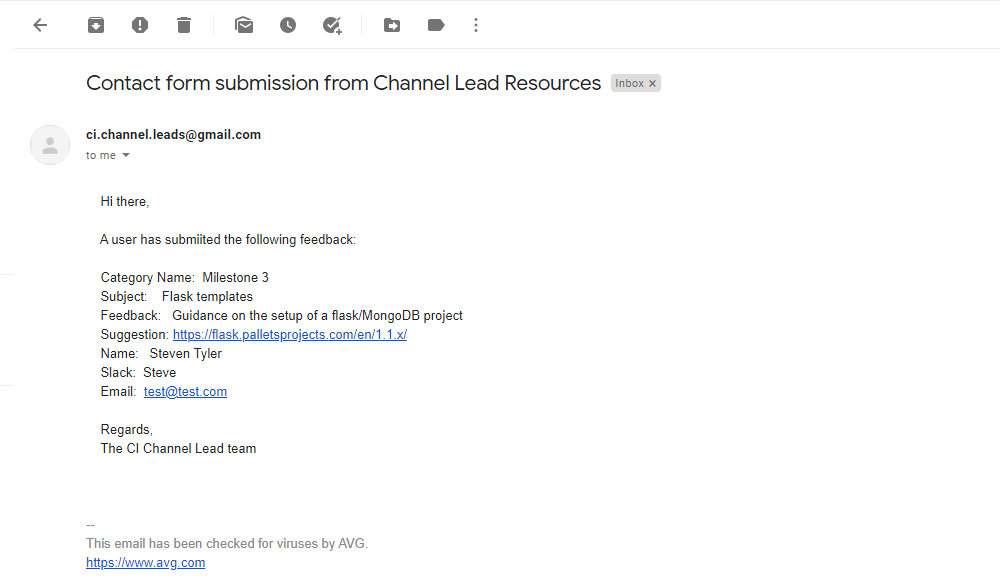

# Table of Contents - TESTING

> &nbsp;
>
> - [User Stories](#user-stories)
> - [Code Validation](#code-validation)
> - [Search Function](#search-function)
> - [Manual Site Testing](#manual-site-testing)
> - [Responsive Tests](#responsive-tests)
> - [Deployment](#deployment)  
> &nbsp;

## User Stories

> &nbsp;
>
> ### **Users _(Code Institute Students)_**
>
> 1. As a user I would like to **have access to past Channel Lead presentations** in one place, so that I can:
>
> - **periodically refer to them after the live presentations**.
> - **refer to them if I cannot make the live presentations**.
>
> #### **TESTING:** After logging in with a user (**'student'**) account, resource material is available on the Resources page. Users can read description of the material posted and view PDF and Videos on modals within each section
>
> 2. As a user I would like to **be able to search the site**, so that I can **easily find resources that I am looking for**.
>
> #### **TESTING:** The search function allows the user to search by keyword, category or both, which makes it easy for the user to source relevant material easily. testing is covered in more detail under [Search Function](#search-function)
>
> 3. As a user I would like to **leave a comment** so that I can **recommend future topics to cover**.
>
> #### **TESTING:** The Contact Page has functionality allowing the user to submit a review and/or suggestion, which is delivered to my email inbox. I cna then copy and paste the informaiton in the 'Channel Lead' Slack channel to highlight the interest of the topic needing to be covered
>
> 4. As a user I would like to **rate a post** (like/dislike-emojis) so that I can **visibly show how valuable the particular resource is to me**.
>
> #### **TESTING:** The rating functionality has been moved to 'Features Left to Implement' due to time constraints
>
> 5. As a user I would like to **access the information from anywhere**, so that I can **watch and read presentations on my mobile phone/tablet**.
>
> #### **TESTING:** Site designed with mobile-first responsive approach, allowing the user to easily access the information provided on mobile and tablet devices
>
> &nbsp;
>
> ### **Admin _(Code institute Slack Channel Leads)_**
>
> 1. As an Admin I would like the ability to **log into an admin account**, so that I can **create resource posts**.
>
> #### **TESTING:** The **'Lead'** username and dedicated password was added for Channel leads with access to the Manage Resources dashboard page, whereby they can Create new material with the Add Resources button, which redirects to the Add Resources page. This page presents a form for all relevant fields for a post, seperated by categories
>
> 2. As an Admin I would like the ability to **upload my presentations**, so that I can **add new material to the site**.
>
> #### **TESTING:** On the above Add Resources page, various options were attempted fopr PDF and Video uploads, but without a paid hosting service, admin users are requested to host these resources themselves and paste a link into the inputs for each instead. The upload functionality will need to be implemented at a later stage once skills develop
>
> 3. As an Admin I would like the ability to **update my presentations**, so that I can **maintain material previously uploaded to most recent versions**.
>
> #### **TESTING:** On the Manage Resources page, admin users have the Edit Resources
>
> 4. As an Admin I would like the ability to **delete my presentations**, so that I can **remove outdated information, which may become irrelevant due to technological advances**.
>
> #### **TESTING:** On the Manage Resources page, admin users have the Delete Resources
>
> - As an Admin I would like the **ability for users to review my presentations**, so that I can **be informed of how useful they are and if anything can be improved upon**
>
> #### **TESTING:** Users are able to review posts from the Contact Page by submitting a review and/or suggestion. The 'rate/review' functionality for individual posts has been moved to 'Features Left to Implement' due to time constraints
>
> &nbsp;
>
> ### **Superuser _(Developer-Site Creator)_**
>
> In addition to the above,
>
> 1. As a Superuser I would like to be able to **keep information aimed at Code Institute Students**, so that **material posted is not directly available to the general public**.
>
> #### **TESTING:** Only assigned Student, Lead, Superuser and Assessor accounts have access to the site via pre-added usernames and passwords. The general public does only has access to the Home & Login screens
>
> 2. As a Superuser I would like to be able to **Create Admin accounts**, so that I can **assign them to users**.
>
> #### **TESTING:** On the Manage Users page, the Superuser account has the ability to Add usernames and passwords
>
> 3. As a Superuser I would like to be able to **Delete User accounts**, so that I can **maintain control of user accounts**.
>
> #### **TESTING:** On the Manage Users page, the Superuser account has the ability to Delete usernames
>
> 4. As a Superuser I would like to be able to **Update Category names**, so that I can **ensure the site is kept neat**.
>
> #### **TESTING:** On the Manage Categories page, the Superuser account has the ability to Add new categories and Edit existing categories names
>
> 5. As a Superuser I would like to be able to **Delete Categories**, so that I can **keep the site clean and clutter free**.
>
> #### **TESTING:** On the Manage Categories page, the Superuser account has the ability to Delete existing categories
>
> &nbsp;
>
> ### **Assessor _(Milestone Project Assessor)_**
>
> 1. As an Assessor, I will require full access to all Superuser privileges, so that I can gain full access in order to assess all aspects of the project.
>
> #### **TESTING:** The **'Assessor'** username and password created to allow a Project Assessor full access to the project with all priveledges of a Superuser, but with dedicated login details
>
> &nbsp;

## Code Validation

> ### HTML
>
> Passed code through [Nu Html Checker](https://validator.w3.org/#validate_by_uri) by entering the 'Validate by URI method.
>
> - Error given for **br** tag in **li** item in the footer on base.html - resolved by removing **br** tags and using Bootstrap margin class instead.
>
> - 2 x errors regarding modals on the base.html (for the form target and aria-labelled-by)- resolved by moving these modals to their respective pages.
>
> After resolving the above, all errors and warnings are cleared.
>
> 
>
> ### CSS
>
> Passed code through [W3C CSS Validator](https://jigsaw.w3.org/css-validator/#validate_by_input) by pasting code in by direct input method
>
> - No errors found
> - 8 warnings relating to custom colour variables - safely ignored.
>
> 
>
> ### JavaScript
>
> Passed code through [JSHint](https://jshint.com/)
>
> - Two warnings for missing semi-colons(resolved)
> - Warning for ''let' is available in ES6 (use 'esversion: 6') or Mozilla JS extensions (use moz).' - Safely ignored.
> - JSHint flags Jquery $ symbol as undefined variable - safely ignored.
>
> 
>
> ### Python
>
> Autopepe8 installed as a dependency for checking code as written
> All Python code passed through [ExtendsClass Python Syntax Checker](https://extendsclass.com/python-tester.html)
>
> - [app.py](./app.py)
>
> 
>
> - [routes.py](../routes/errors.py)
>
> 
>
> - [errors.py](../routes/errors.py)
>
> 
>
> - [mail_settings.py](../config/mail_settings.py)
>
>   
> &nbsp;

## Search Function

(Resources, Manage Resources and Manage Categories pages)

> &nbsp;
>
> - Clicked submit button with no entries in any fields - page resets to show all resources.
> - Entered valid keyword and page returns relevant resource(s) containing that keyword.
> - Entered invalid keyword and page returns the message: 'No results found, please try another search'.
> - Entered keyword and selected category:
>   - If keyword is valid and category is valid, page returns relevant resource(s) containing that keyword within the category selected.
>   - If keyword is valid but not in the selected category, page returns the message: 'No results found, please try another search'.
> - Selected category only with no keyword entered, page returns a list of resources of the selected category.
> - Clicked Reset button and this clears the search inputs to default.  
> &nbsp;

## Manual Site Testing

> &nbsp;
>
> ### Navigation
>
> - Checked all navigation links from menu to ensure they direct to relevent pages
>
> ### Home page
>
> - Clicked Login Button and redirects to Login page
>
> ### Login page
>
>
> - Clicked **Log Out** button from Navigation Menu.
>
> - Successfully logs user out of their session
> - Redirects user to the Home page
> - Relevant Flash confirmation message displays correctly.
>
> ### Footer
>
> - Tested all **Useful Links** links to ensure they open correctly in a new browser tab
> - Tested all social media icons links to ensure they open correctly in a new browser tab
>
> ### Resources page
>
> - Tested PDF and Video links (with content) to ensure they load as intended
> - Tested PDf and Video links (with no content) to ensure the correct messages are displayed  
>
> ### Manage Users page
>
> #### Add User section
>
> - When Add User button is clicked and 'required' fields are empty, the user receives a notification to fill in the relevant fields.
> - Entered username and password and clicked Add User button.
>   - Confirmed that new details are added to the **users** collection on the database
>   - The new username populates the list.
> - Relevant Flash confirmation message displays correctly.
> - Logged out and logged back in with the new username and password.
>   - User is logged in with 'student/user' credentials.
> - Relevant Flash confirmation message displays correctly.
>
> #### Delete User section
>
> - Delete buttons for Assessor, Superuser, Lead and Student accounts are not visible.
> - Clicked Delete button for additional user and confirmation modal appears.
>   - Clicked modal Cancel button. Modal cancels and returns user to the Manage User page.
>   - Clicked modal Confirm button and username is deleted from **user** collection on the database.
> - Relevant Flash confirmation message displays correctly.
>
> ### Manage Resources page
>
> #### Add Resource section
>
> - Clicked Add Button and user is redirected to the Add Resource Page
>
> #### Edit/Delete Resource section
>
> - Clicked Edit Button and user is redirected to the Edit Resource Page
> - Clicked Delete button and confirmation modal appears
>   - Clicked modal Cancel button and modal closes.
>   - Clicked modal Confirm button and Resource is deleted from **cl_resources** collection on the database.
> - Relevant Flash confirmation message displays correctly.
>
> ### Add Resources page
>
> - When Confirm button is clicked and 'required' fields are empty, the user receives a notification to fill in the relevant field.
> - Clicked **Instructions** button  on video label and correctly opens PDF modal
> - Clicked Cancel button and redirect user back to the Manage Resources page
> - Clicked Confirm button (with required fields correctly filled in).
>   - Confirmed that the **cl_resources** database collection is correctly populated with input data.
>   - User is redirected back to the Manage Resources page.
> - Relevant Flash confirmation message displays correctly.
>   - New Resource entry correctly displays on the Resources page and Manage Resources page list.
>
> ### Edit Resources page
>
> - When Confirm button is clicked and 'required' fields are empty, the user receives a notification to fill in the relevant field.
> - Clicked **Instructions** button  on video label and correctly opens PDF modal
> - Clicked Cancel button and redirect user back to the Manage Resources page
> - Clicked Confirm button (with required fields correctly filled in) and the confirmation modal opens.
>   - Clicked modal Cancel button and modal closes.
>   - Clicked modal 'Yes' button and user is redicted back to the Manage resources page.
> - Relevant Flash confirmation message displays correctly.
> - Confirmed that the **cl_resources** database collection is correctly updated with input data.
>
> ### Manage Categories page
>
> #### Add Category section
>
> - Entered new category name and clicked Add Category button.
>   - Confirmed that new details are added to the **categories** collection on the database.
>   - The new category populates the list and on all Select elements on relevant pages.
>   - User remains on Manage Categories page and page refreshes.
> - Relevant Flash confirmation message displays correctly.
>
> #### Edit/Delete Category section
>
> - Clicked Edit Button and user is redirected to the Edit Category Page.
> - Clicked Delete button and confirmation modal appears.
>   - Clicked modal Cancel button. Modal cancels and returns user to the Manage Categoriespage.
>   - Clicked modal Confirm button and Resource is deleted from **cl_resources** collection on the database.
> - Relevant Flash confirmation message displays correctly.
>
> ### Edit Category page
>
> - When Confirm button is clicked and 'required' field is empty, the user receives a notification to fill in the relevant field.
> - Clicked Cancel button and redirect user back to the Manage Categories page
> - Clicked Confirm button (with required field filled in) and the confirmation modal opens.
>   - Clicked modal Cancel button and modal closes.
>   - Clicked modal 'Yes' button and user is redicted back to the Manage Categories page.
> - Relevant Flash confirmation message displays correctly.
> - Confirmed that the **categories** database collection is correctly updated with input data.
>
> ### Error page
>
> - Entered a series of invalid url suffixes and user is redirected to 404 error page.
> - Tested button on 404 error page to ensure it links back to the Home page
>
> &nbsp;
>
### Contact page
>
> &nbsp;
>
> - When Submit button is clicked and 'required' fields are empty, the user receives a notification to fill in the relevant fields.
> - When submitting a completed form, user receives a flash message notification that the feedback/suggestion has been sent.
> - Confirmed that form resets to blank fields after form submission has been completed.
> - After submission, checked email inbox and email from the site is successfully recieved.
>
> &nbsp;
>
> 
>
> &nbsp;

## Responsive Tests

> &nbsp;
>
> - DevTools - Devices tested across a range of widths:
>   - Mobiles: iphone5(320px) | Samsung S5 (360px) | iPhone 6/7/8/X (375px) | iPhone 6/7/8 Plus (414px)
>   - Tablets: iPad (768px) | iPad Pro (1024px)
>   - Desktops: Laptop (1200px) | Large Desktop screen (1920px)
>
> - Viewed on physical devices:
>   - Mobiles: small phone (320px) | large phone (414px)
>   - Tablets: large tablet (768px)
>   - Desktops: Medium laptop (1366px) | Large Desktop screen (1920px)
>
> - Viewed site on above range (including Responsive mode) on various browsers: >   - Google Chrome
>   - Firefox
>   - Opera
>   - Safari
>
> **Note**: When select element is viewed on mobile in **DevTools**, the *select* elements' dropdowns extend offscreen. However, this is not an issue on physical mobile devices as the mobile browser renders it's own native form elements.
>
> **DevTools view of select dropdown**
>
> 
>
> **Device view of select dropdown**
>
> 
>
> &nbsp;

## Deployment

> &nbsp;
>
> Ensured deployed page on Heroku loads up correctly.
> Ensured Debug variable in app.py file is set to False
> Ensure Debug variable in mail_settings.py is set to False
> &nbsp;
>